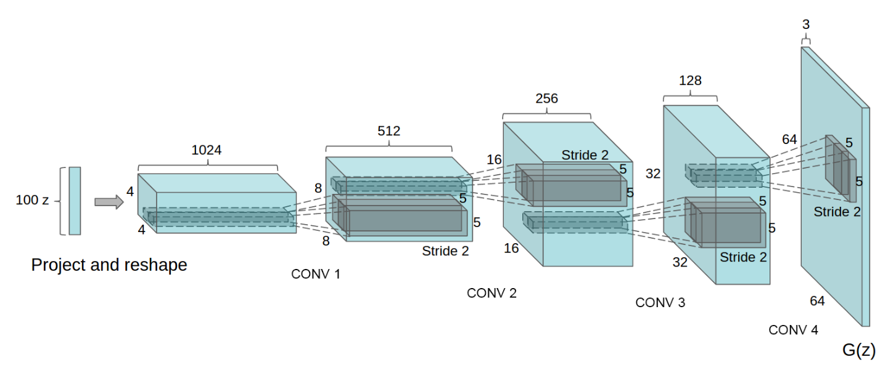

# DCGAN_learn
This is me trying to learn how the DCGAN works while also flexing my pytorch muscles

This readme is thus me learning and I will document what I understand.

# Notebooks
The notebooks are used to run scripts so I can see what is happening. =)

# Architecture
The network architecture is not super well described, but here seems to be the best description of it in the paper.

> The first is the all convolutional net (Springenberg et al., 2014) which replaces deterministic spatial pooling functions (such as maxpooling) with strided convolutions, allowing the network to learn its own spatial downsampling. We use this approach in our generator, allowing it to learn its own spatial upsampling, and discriminator.
> 
> Second is the trend towards eliminating fully connected layers on top of convolutional features. The strongest example of this is global average pooling which has been utilized in state of the art image classification models (Mordvintsev et al.). We found global average pooling increased model stability but hurt convergence speed. A middle ground of directly connecting the highest convolutional features to the input and output respectively of the generator and discriminator worked well. The first layer of the GAN, which takes a uniform noise distribution Z as input, could be called fully connected as it is just a matrix multiplication, but the result is reshaped into a 4-dimensional tensor and used as the start of the convolution stack. For the discriminator, the last convolution layer is flattened and then fed into a single sigmoid output. See Fig. 1 for a visualization of an example model architecture. 
>
> Third is Batch Normalization (Ioffe & Szegedy, 2015) which stabilizes learning by normalizing the input to each unit to have zero mean and unit variance. This helps deal with training problems that arise due to poor initialization and helps gradient flow in deeper models. This proved critical to get deep generators to begin learning, preventing the generator from collapsing all samples to a single point which is a common failure mode observed in GANs. Directly applying batchnorm to all layers however, resulted in sample oscillation and model instability. This was avoided by not applying batchnorm to the generator output layer and the discriminator input layer.
>
> The ReLU activation (Nair & Hinton, 2010) is used in the generator with the exception of the output layer which uses the Tanh function. We observed that using a bounded activation allowed the model to learn more quickly to saturate and cover the color space of the training distribution. Within the discriminator we found the leaky rectified activation (Maas et al., 2013) (Xu et al., 2015) to work well, especially for higher resolution modeling. This is in contrast to the original GAN paper, which used the maxout activation (Goodfellow et al., 2013).
<!--  -->
Using this description, and fig 1 of the paper:

The Generator architecture should be well defined..

# Generator
Lets assume a 100 dim latent dimensional space as per Fig1.
## Fully connected linear layer
The first layer seems to be a linear layer that expands that 100 dim into 1024x4x4, with 1024 channels. Given the batch norm paragraph, it seems that batch norm should be inserted here.
## Conv layers
The Conv layers should be the ConvTranspose2d pytorch function which expands the number of dimensions while also decreasing the number of channels. So, for Conv1 we have
1024 x 4 x 4 -> 512 x 8 x 8 (stride 2)
Following the ReLU paragraph, for Conv1 - Conv3, we use
BatchNorm + ReLU (in that sequence) and for Conv4, we use BatchNorm Tanh

## Learnings after trying to implement it
- You can move stuff layer by layer to different devices.
- use `self.to(device)` to move the entire model to the desired device.
- there is a sneaky part to initialize all model weights to a normal distribution at the start of training. 
- last layer has no batch norm.. almost missed that.

# Discriminator
Now is the detective work. what do we want to do? We need to take a 3 channel 64x64 image and output a single float.

## Conv layers
The Conv layers should be the Conv2d pytorch function with a stride of 2. This should reduce the dim by a factor of 2 each time. Also, other than the first conv layer, all other conv layers should also include a BatchNorm and a LeakyReLU (all layers).

## Final layer.
The final conv layer should output a 1024 channel 4x4 tensor. We need to reduce this to a single float. We use a Linear + Sigmoid? Lets also add a Flatten in front..  

# Training loop.
The GAN training loop tries to solve a minimax problem 